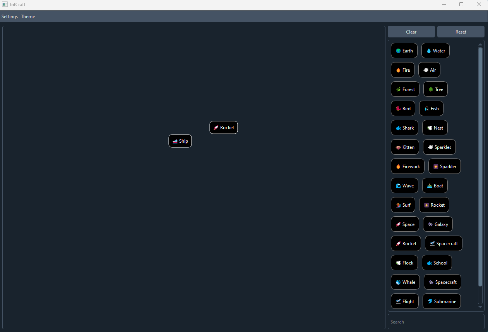
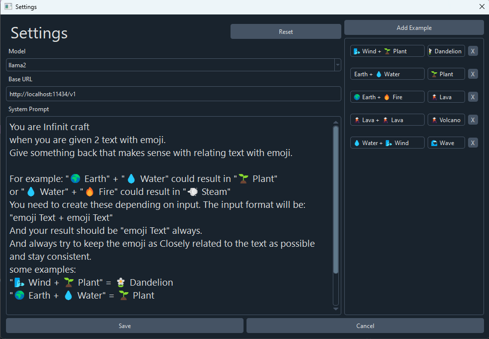

# Infinite-Sides

Infinite Craft but in pyside6 and in your computer using local LLM with [ollama](https://github.com/ollama/ollama) and also has a dark mode.

## Screenshots

<p>
  
  
</p>


## Installation

### Git

Requirements
- git (not required if you download zip file from [release](https://github.com/Fus3n/flang/releases/latest))
- python3.10+

Make sure you have [ollama](https://github.com/ollama/ollama) set up already and have atleast one model, currently infinite-sides uses llama2, all the installation guide is in their [github page](https://github.com/ollama/ollama)

But for basics, just install the binary and type this in terminal:
`ollama run llama2` it should download llama2 model and make sure the ollama application is running in background

> You also need a relatively decent computer/gpu to get reasonable speed in the game, it will generate the response in your computer afterall

Windows:
```
git clone https://github.com/Fus3n/infinite-sides
.\start.bat
```
Linux (not tested):

```
git clone https://github.com/Fus3n/infinite-sides
python3 start.py
```

> This software is still under development, alot of features are missing and alot of bugs, the plan is to make it so people can make different types of crafitng game for example a minecraft edition or one thats only related a specific subject and people can make custom system prompts and share with others and enjoy it

Licensed under the MIT License.

