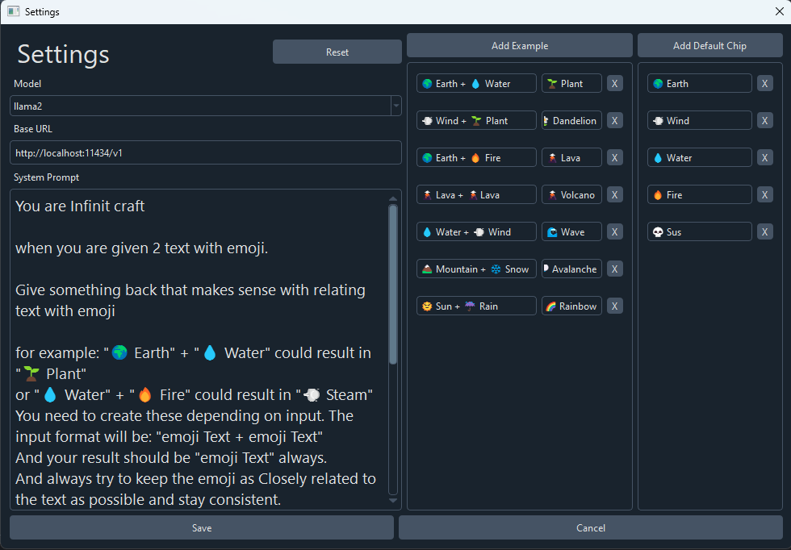

# Infinite-Sides

Infinite Craft but in pyside6 and in your computer using local LLM with [ollama](https://github.com/ollama/ollama) and also has a dark mode.

Create your own infinite Crafting game 

## Screenshots

<p>
  
  
</p>


## Installation ⏬

### SourceForge
[](https://sourceforge.net/projects/infinite-sides/files/latest/download)

### Git

Requirements
- git (not required if you download zip file from [release](https://github.com/Fus3n/infinite-sides/releases/latest))
- python3.10+

Make sure you have [ollama](https://github.com/ollama/ollama) set up already and have atleast one model, currently infinite-sides uses llama2, all the installation guide is in their [github page](https://github.com/ollama/ollama)

But for basics, just install the binary and type this in terminal:
`ollama run llama2` it should download llama2 model and make sure the ollama application is running in background

> You also need a relatively decent computer/gpu to get reasonable speed in the game, it will generate the response in your computer afterall

Windows:
```
git clone https://github.com/Fus3n/infinite-sides
cd infinite-sides
.\start.bat
```
Linux (not tested):

```
git clone https://github.com/Fus3n/infinite-sides
cd infinite-sides
python3 start.py
```

# Usage/Controls 🎮
- Click on chips (text with emojis) to add them to the game
- Click hold and drag them and release on top of another to combine
- Clear button clears everyhing in game
- Reset button resets the list/all the chips you have collected and also clears the game view
- Change all the parameters in `App > Settings`

### Settings

For app settings you can open `App > Settings`
and set your desired prompt and model.
You can also set the base URL that ollama runs on, if it ever changes you need to set that, for now its using the default one. 

You can also port forward using ngrok and use that url if you want and share it with your friends.


> This software is still under development, alot of features are missing and alot of bugs, the plan is to make it so people can make different types of crafitng game for example a minecraft edition or one thats only related a specific subject and people can make custom system prompts and share with others and enjoy it

Licensed under the MIT License.

